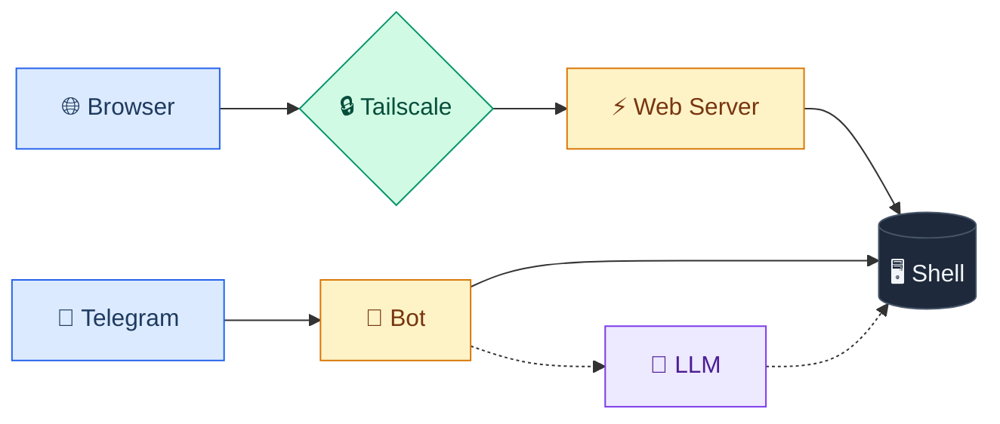

# remote-terminal

<p align="center">
  
</p>

<p align="center">
  <strong>Your terminal, anywhere.</strong><br>
  Access your dev workspace via browser, Telegram, or AI — secured with Tailscale.
</p>

<p align="center">
  <a href="#features">Features</a> •
  <a href="#quick-start">Quick Start</a> •
  <a href="#telegram-bot-commands">Telegram Bot</a> •
  <a href="#llm-mode">LLM Mode</a>
</p>

---

Access your development workspace from anywhere — via browser, Telegram, or AI assistant.

remote-terminal gives you a secure, portable command center for your codebase. Run commands from your phone, use natural language with AI, or open a full terminal in your browser — all tunneled securely through Tailscale.

## Features

- **Web Terminal** — Full xterm.js terminal in your browser with color support, copy/paste, and responsive design
- **Tailscale Integration** — Secure access from anywhere on your tailnet via HTTPS
- **Telegram Bot** — Run commands from your phone with predefined shortcuts or raw shell commands
- **LLM Mode** — Natural language interface powered by OpenAI — just describe what you want to do
- **Multi-session** — Multiple concurrent terminal sessions supported

## Quick Start

```bash
# Install dependencies
npm install

# Create .env file (see Configuration below)
cp .env.example .env

# Start the server
npm start

# Or run without Tailscale for local development
npm run dev
```

Open http://localhost:7860 in your browser.

## Configuration

Create a `.env` file in the project root:

```env
# Telegram Bot (optional)
# Create a bot via @BotFather on Telegram
TELEGRAM_BOT_TOKEN=your-bot-token
# Get your user ID from @userinfobot
TELEGRAM_ALLOWED_USERS=123456789

# OpenAI API Key for LLM mode (optional)
OPENAI_API_KEY=your-openai-api-key
OPENAI_MODEL=gpt-4.1-nano

# Workspace directory (defaults to current directory)
WORKSPACE=~/projects/myapp
```

## Usage

### Web Terminal

Access the terminal at `http://localhost:7860` (local) or `https://your-hostname.ts.net` (via Tailscale).

### Telegram Bot Commands

| Command | Description |
|---------|-------------|
| `/start` | Show help and available commands |
| `/status` | Git status |
| `/pull` | Git pull |
| `/log` | Recent commits |
| `/diff` | Git diff summary |
| `/ls` | List files |
| `/branch` | List branches |
| `/build` | Build project |
| `/test` | Run tests |
| `/dev` | Start dev server (long-running) |
| `/url` | Show web terminal URL |
| `/stop_proc` | Stop background process |
| `/llm` | Toggle LLM mode |
| `/llm_clear` | Clear LLM conversation history |

**Raw Commands:** Send any shell command directly (without `/`) and it will be executed.

### LLM Mode

Enable with `/llm` and interact using natural language:

- "show me the git status"
- "list all JavaScript files in src"
- "what does the main function do?"
- "create a new branch called feature-login"
- "find all TODO comments in the codebase"
- "run the tests and tell me if anything failed"

The AI can run multiple commands, analyze output, and provide helpful summaries.

## CLI Commands

```bash
# Start everything (web terminal + Tailscale + Telegram)
remote-terminal start

# Start without Tailscale
remote-terminal start --no-tailscale

# Start without Telegram
remote-terminal start --no-telegram

# Expose a specific port via Tailscale
remote-terminal expose 3000

# Expose publicly via Tailscale Funnel
remote-terminal expose 3000 --funnel

# Remove all Tailscale configurations
remote-terminal unexpose

# Show status
remote-terminal status
```

## Architecture



## Tech Stack

- **Backend:** Node.js, Express, express-ws
- **Terminal:** node-pty, xterm.js
- **Telegram:** Telegraf
- **LLM:** OpenAI API (GPT-4.1 nano)
- **Tunnel:** Tailscale

## Requirements

- Node.js >= 18.0.0
- Tailscale (optional, for remote access)
- Telegram Bot Token (optional, for Telegram integration)
- OpenAI API Key (optional, for LLM mode)

## Security Considerations

- The web terminal provides full shell access — only expose it on trusted networks
- Tailscale Serve restricts access to your tailnet by default
- Use Tailscale Funnel with caution — it exposes your terminal to the public internet
- Telegram bot only responds to user IDs in `TELEGRAM_ALLOWED_USERS`
- Never commit your `.env` file

## License

MIT

## Contributing

Contributions are welcome! Please open an issue or submit a pull request.
